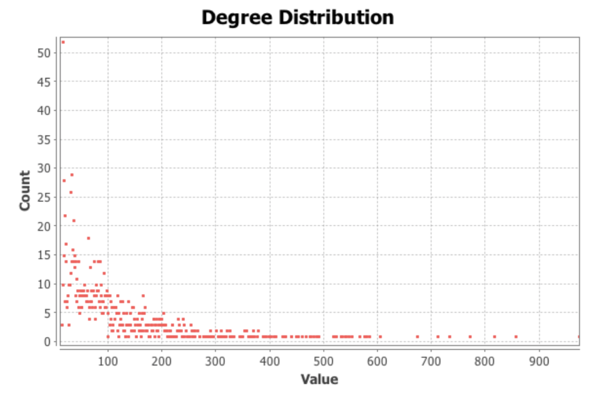

# NBA Player Network #

## About ##

This project generates the network consisting of NBA players connected to each other if they have been teammates in any of the last 10 years. 

Data was scraped from [Basketball Reference](https://basketball-reference.com/) via Java's `JSoup` library.

The network was implemented using two data structures: a `HashMap` which maps each player to the players they have ever played with, and a `LinkedList` of players on a team roster in any given year. 

The network was then loaded onto the data visualization platform Gephi. Gephi was used to report the network's various characteristics, such as diameter, clustering coefficient and degree distribution. 

## Contributors ## 

Evan Tao, Ankit Das, Yoni Nachmany

## Dependencies ## 

`JSoup 1.17.1`

## Testing ##

- Compile `javac -cp .:jsoup-1.17.1.jar Main.java`
- Run `java -cp .:jsoup-1.17.1.jar Main`, and then type in the years (i.e. `2012`) of whichever seasons you want to include in the network. 

## Conclusions ##

- There are `1411` nodes and `31700` edges in this undirected graph. 
- The diameter is a low `3.` 
- The clustering coefficient is a relatively high `0.547.` 
- The degree distribution is heavy tailed.

